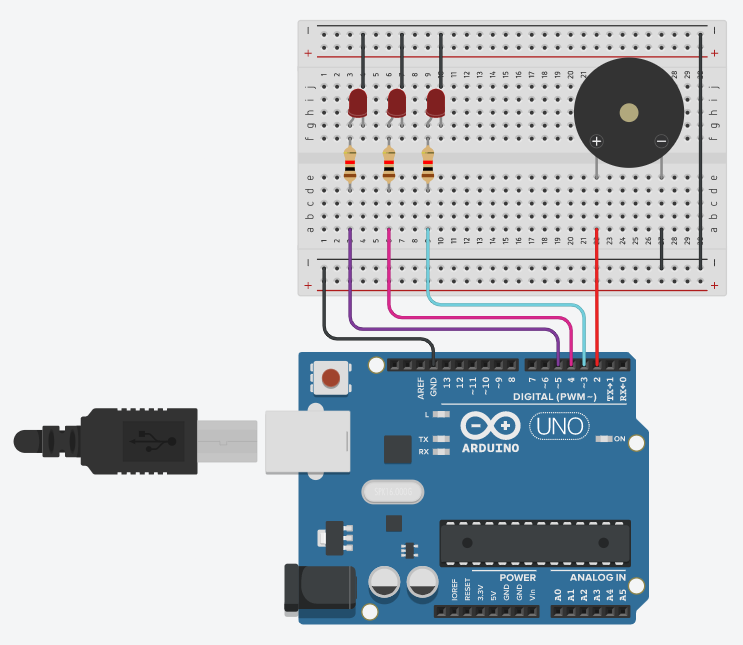

# Musiccini: Arduino Ultra-lightweight Music Synthesis Library

Musiccini is intended to be super duper lightweight library for synthesizing music in Arduino with a buzzer. It is easy to use, easy to install, and doesn't use any external dependencies.

```
int buzzer = 8;   // Buzzer pin
int song[] = {};  // Define the song that will be synthesized

Musiccini music;
music.init(buzzer);
music.play(/* BPM */, /* Song */, /* Length */);
```

You can also check the [example.ino](./example/example.ino) included in this repository which showcases the Musiccini basic usage that uses the diagram below.



## Installation

Download this repository, then open the Arduin IDE you have installed on your system. And then, from the menu bar above ***Sketch > Include Library > Add .ZIP Library*** Or you can simple extract the *libraries* folder to the Arduino folder in the documents.

## Demo

I am using an Arduino UNO R3 clone for this demonstration.

<video src="example/demo.mp4" controls autoplay width="640" height="320"></video>

## Documentation

#### ```Musiccini::init(int buzzerPin)```

Definition of the Musiccini object contructor.

Parameters:
- ```int buzzerPin``` - The digital pin of the buzzer for the output sound.

-----
#### ```void Musiccini::reset()```

Resets the information of Musiccini object.

-----
#### ```void Musiccini::play(int tempo, int song[], size_t length)```

Plays the defined song once. The length must be the size of the ```song[]``` parameter.

Parameters:
- ```int tempo``` - The tempo of the song. An integer positive number that will represent the BPM (or the Beats Per Minute) when synthesized.
- ```int song[]``` - An integer single-dimension array the contains the definition of the song melody. Check the [example.ino](./example/example.ino) sketch for formatting example.
- ```size_t length``` - This parameter must always be containing the actual length of the ```song[]``` parameter.

-----
#### ```void Musiccini::after_note(MusicciniEvent after_evt)```

Sets the event listener which will be fired/called whenever a note was played.

Parameter:
- ```MusicciniEvent after_evt``` - The function callback that will be invoked after a note was played.

-----
#### ```void Musiccini::before_note(MusicciniEvent before_evt)```

Sets the event listener which will be fired/called whenever a note will be played.

Parameter:
- ```MusicciniEvent before_evt``` - The function callback that will be invoked before a note was played.

-----
#### ```bool Musiccini::was_played()```

Returns true if the song was finished playing.

-----
#### ```bool Musiccini::is_done()```

Returns true if the song was finished playing and has stopped.

## License

See [LICENSE.txt](LICENSE.txt)

*Copyright 2022 (c) Nathanne Isip*
